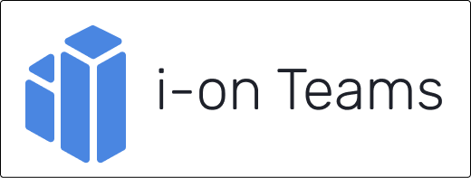

 
 

        
        
        
        
    

## Overview

The i-on Teams project provides a system  providing apps for both students and teachers made to improve efficacy and help with the management of GitHub repositories, in a classroom context.

## OAuth App

The OAuth App used to authenticate users on our applications on Github, is associated with the [i-on Teams](https://github.com/i-on-Teams) organization.

## Repository organization

* [Code](code)
  * [Client Applications](code/js)
    * [Desktop App](code/js/desktop)
    * [Web App](code/js/web)
  * [API](code/jvm)
  * [Base de dados](code/sql)
* [Documents](docs)
  * [Project documentation 2022](docs/2022)
  * [AWS](docs/AWS)
  * [API documents](docs/api)
  * [Auth documents](docs/auth)
  * [Data model](docs/data_model)
    
## Get started

