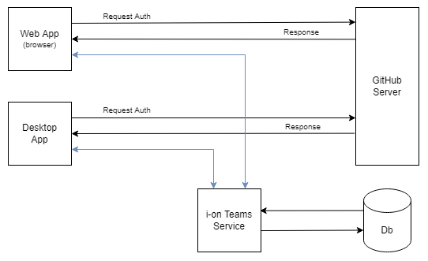
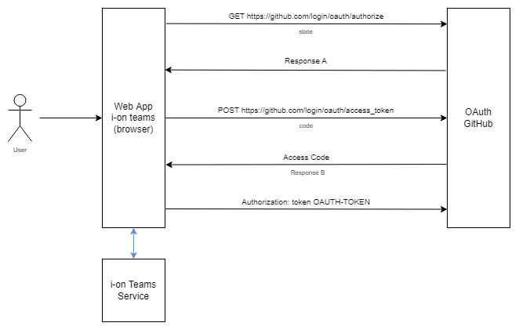
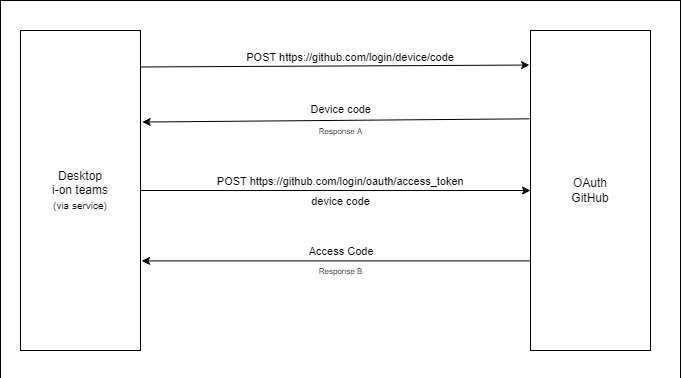

# Authentication 

The image below represents a simpler version of the authentication, showing all the components involved.

____

## OAuth App vs GitHub App

| | OAuth App | GitHub App |
|---|---|---|
|Teacher and Student|Acts on behalf of an authenticated GitHub user.|Uses user identity to act.|
|Teacher and Student| Doesn't require installation of the app on GitHub ClassRoom. | Requires installation of the app on GitHub ClassRoom.|
|Teacher| Can delete an OAuth access token to remove access. | Needs permissions to uninstall an remove access to repo. |
|Teacher | Requires the user to have administrator privileges to execute certain actions. | No need for administrator privileges, because App is installed on Classroom|
____

## Authorizing Users

Users will be authorized via ``OAuth App`` (GitHub), using [Web Application Flow](#web-application-flow) for the student and [Device flow](#device-flow) for the teacher.

### Web Application Flow

- Response A - Contains the ``code``, that is temporary and will expire after 10 minutes, and ``state`` initially passed in the first request.
- Response B - returns the Access Token. We can specify the format we want (e.g. application/json)

### Device Flow

- Response A - returns the Device code. We can specify the format we want (e.g. application/json)
- Response B - returns the Access Token. We can specify the format we want (e.g. application/json)

___
## Information needed to store in DB
#### Student - Web Flow
- ``client_ID``
- ``client_secret`` (encrypted)
- ``code``
- Access Token (encrypted)
  - expiration_date
- Scopes - lists the scopes your token has authorized
  - ``read:user``- Grants access to read a user's profile data.
  - ``write:repo_hook`` - Grants read, write, and ping access to hooks in public or private repositories.

#### Teacher - Device Flow
- ``client_ID``
- ``client_secret`` (encrypted)
- ``code``
- For the teacher both access token and device code are stored locally
- Scopes - lists the scopes your token has authorized
  - ``read:user``- Grants access to read a user's profile data.
  - ``admin:org`` - Fully manage the organization and its teams, projects, and memberships.
  - ``write:org`` - Read and write access to organization membership, organization projects, and team membership.
  - ``repo`` - 	Grants full access to repositories, including private repositories.

_____
## GitHub documentation

[Authorizing OAuth Apps](https://docs.github.com/en/developers/apps/building-oauth-apps/authorizing-oauth-apps)

[Scopes For Auth Apps](https://docs.github.com/en/developers/apps/building-oauth-apps/scopes-for-oauth-apps)
